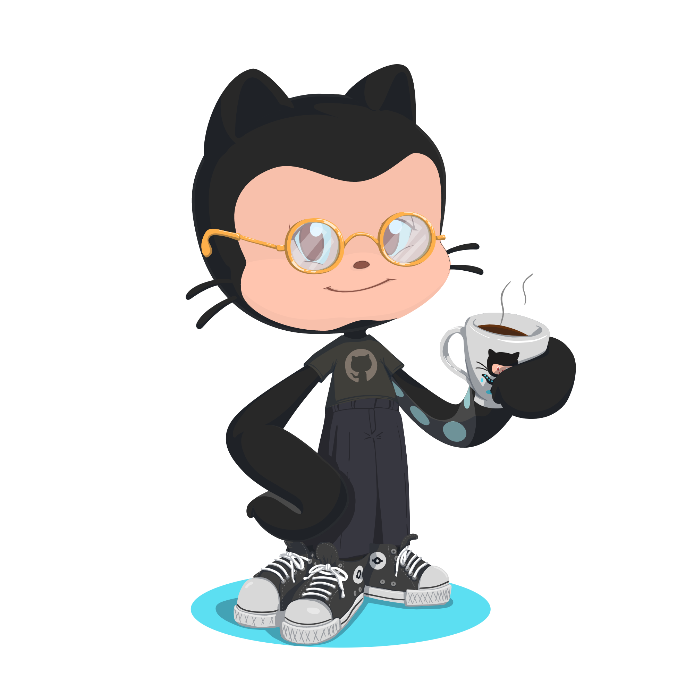

## Olá, sou Marcel Schmidt

- 🖥 Desenvolvedor Full Stack
- 🌱 Cursando Análise e Desenvolvimento de Sistemas | Univates
- 💾 Aluno da 1ª turma do CRIE-TI | Univates

---

<!-- 

-->

<!--  -->

---

### Conecte-se comigo

